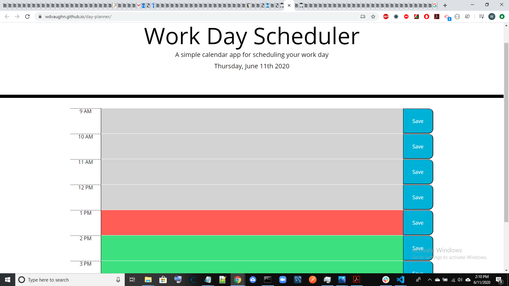

# Day Planner
## Link to Day Planner
https://wdvaughn.github.io/day-planner/

## How Day Planner works
Uses JQuery and moment.js to setup a planner for a work day.  The planner is setup so that past hours are grey, future hours are green, and the current hour is red.  Schedule items can then be saved in local storage so that they can be referred to later, they can also be deleted. 

## Technologies Used
HTML, JavaScript, JQuery, moment.js, local storage

## Start
Here is what the day planner looks like on startup.

## Plans Made
Here is what the day planner looks like after scheduling an item

